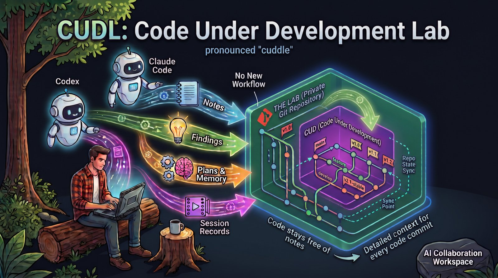

# cudl: Code Under Development Lab

cudl (pronounced "cuddle") is for working on code with coding agents such as Claude Code and
Codex. Besides the code, the agents produce plans, notes, findings, a memory of what they learned
and a record of each session. cudl keeps all of that in a private git repository of its own, the
*lab*, with your code repositories inside it as git submodules. The code stays free of notes, and
every lab commit records which code commits its notes were written against.

There is no new workflow to learn: the agents know how to use cudl, and cudl adapts to the way you
and they already work.

## Why

What the agents write around the code is what lets the next session, or you a month later, carry
on where the last one stopped. It needs version control as much as the code does, but not the
same one:

- Committed to the code repository, it ends up in the branches you push and the pull requests you
  open, unless you strip it out first.
- Left where the agents put it by default (under `~/.claude/` or `~/.codex/`), it has no history,
  is spread over several places, and doesn't say which version of the code it describes.

A lab keeps the two apart, and tied together. The code repositories hold only code, so publishing
is a plain push. The lab holds everything else, and work that spans several repositories has one
place for its notes.

## How it works

A lab looks like this:

```
myproject-lab/          a private git repository, never pushed upstream
  AGENTS.md, CLAUDE.md  instructions for the agents
  handoff/main.md       one page: where the work stands and what's next
  plans/ notes/ docs/   plans, findings, reports, figures
  memory/               what the agents learned, one fact per file
  journal/sessions/     one log per session
  journal.md            findings and decisions over time
  code/myrepo/          your code, one submodule per repository
  wt/<feature>/         features in progress
```

Code changes are made in **features**. A feature is a git worktree of the lab on its own branch.
Inside it, each code repository the feature changes is a worktree on a branch named after the
feature; the other repositories are checked out, read-only, at the commits the lab points to.
Finishing a feature merges its code into each repository's integration branch, and its notes and
session logs into the main lab.

You rarely run cudl yourself: the lab teaches the agents to use it. Its instructions (`AGENTS.md`)
say when to start a feature and what to leave to you, its skills (`commit`, `wrap`) commit code and
notes together and wrap a session up, and every session starts from the handoff. Underneath, the
`cudl` command does the two-level git: it creates features, commits the code repositories and then
the lab, brings features up to date and finishes them. Hooks in the agents' settings run it at the
start and end of every session to keep the logs.

Claude Code and Codex share the lab: the same instructions, skills, memory, journal and handoffs.

## A day in a lab

1. **Start your agent in the lab:** `claude` or `codex` in the lab's directory. It picks up from
   the handoff and the last few sessions, not the whole history, and cudl opens a log for the
   session.
2. **Talk, plan, build.** Plans go to `plans/`. When it's time to change code, the agent starts a
   feature (`cudl new dial-fix -r myrepo`), or you ask for one. To work on several things at once,
   `cudl open dial-fix` starts another agent in a feature, in a tmux window.
3. **The agent commits as it goes,** code and notes together. Plain git works too, at both levels.
4. **Wrap up** before you leave: ask for `/wrap` (`$wrap` in Codex). The agent fills in the
   session's log (what was done, what was learned, the dead ends), rewrites the handoff and
   commits.
5. **Finish** a feature when you're happy with it. That step is yours: `cudl finish dial-fix`
   merges it and removes its worktrees, and `cudl push` publishes the code (until you add `--yes`,
   it only shows what it would push).

The next session, in the main lab or in a feature, picks up from the handoff.

## Out of your way

cudl tries not to stand in the way. It follows how you work, tidies up after the fact rather than
refusing, and says no only where history or another session's work is at stake:

- **Plain git, at both levels.** Commit, rebase, amend or squash a feature's branches as you like:
  every code commit the lab ever pointed to is kept, so no note loses the code it describes.
- **Sessions in parallel,** each in its own feature or side by side in the same lab, Claude Code
  beside Codex.
- **One session, several features.** A session can start and work in several features; it gets a
  log in each one where it changes something through cudl, and one wrap covers them all.
- **Sessions started from sessions.** A Codex review run from a Claude session, or a `claude -p` it
  starts, is logged as that session's subagent: it reports back, commits nothing, and its log is
  listed under its parent's. Claude Code's own subagents need nothing at all.
- **Claude Code's worktrees.** `claude -w` makes a cudl feature. Leaving it with "Remove worktree"
  commits what was left and keeps the branches; "Keep worktree" keeps the feature as it is.
- **Building on unfinished work.** A feature can start from another that isn't finished yet
  (`cudl new <child> --from <feature>`), and follows it as it changes.
- **Sessions that just end.** Close a session without a wrap and cudl still closes its log, with
  what it can record: the commits, the files touched, the transcript. A session that never got
  going leaves no log. A log names its transcript's path, and a subagent's keeps the start of the
  prompt it was given: share a lab, and you share those too.
- **Hooks that never block.** A cudl hook that fails says so, and the session goes on.

## What stays yours

The agents create features, commit, and keep features up to date. Finishing a feature, pushing and
upgrading cudl stay with you: the lab's instructions tell the agents to suggest these, not to run
them. cudl never pushes the lab, and pushes code only when you ask.

## Getting started

Install cudl from a clone of this repository:

```
git clone https://github.com/cskiraly/cudl ~/cudl
~/cudl/bin/cudl install   # links cudl into ~/.local/bin, and the cudl skill into both agents
```

`~/.local/bin` needs to be on your `PATH`.

Then ask your agent to set up a lab for your work: the `cudl` skill knows the steps, and how to
move existing work in. Notes committed in a code repository come over with their history, each
pinned to the code it was written against (`cudl split`); memory and plans are copied in; earlier
Claude Code and Codex sessions are listed in the lab's journal (`cudl import-sessions`). For
publishing, `cudl clean-branch` makes a copy of a code branch without the notes.

By hand, a new lab is:

```
cudl init ~/work/myproject-lab
cd ~/work/myproject-lab
cudl add myrepo https://github.com/you/myrepo -b main
```

For a repository you don't own, give it an integration branch of your own, so finished features
don't pile up on upstream's: `cudl add theirs https://github.com/them/theirs -b lab --from main`.
`cudl push` only pushes a branch that has a push remote configured.

Either way, trust the lab once, as `cudl init` tells you: run `claude` in it and accept the trust
dialog, and in `codex`, trust the project and the two cudl hooks in `/hooks`.

cudl needs Python 3.12 and git 2.43 or later; `cudl open` needs tmux, and `cudl split` and
`cudl clean-branch` need `git-filter-repo`.

To upgrade, `git pull` in your clone: the installed `cudl` links to it. Each lab keeps its own copy,
so then run `cudl upgrade` in each lab, review the changes and commit them
(`cudl commit -m "cudl: upgrade"`). A feature made before the upgrade gets it with
`cudl sync -f <feature>`. In Codex, trust the changed hooks again in `/hooks`.

## Status

cudl is young and still changing, and developed on Linux. It runs as one Python script that uses
only the standard library (`bin/cudl`), built from the modules in `cudl/`. Alongside it are the
template it copies into new labs (`template/`) and end-to-end tests on real git repositories
(`python3 -m unittest discover tests`). Not built yet: a summarizer for sessions that ended without
a wrap.

## Read more

- [FEATURES.md](FEATURES.md): everything cudl does, area by area.
- [DESIGN.md](DESIGN.md): why it is built this way, and what using it has taught.
- `cudl --help`, and `cudl <command> --help`.

## License

cudl is MIT-licensed ([LICENSE](LICENSE)); the notice is also at the top of `bin/cudl`, so the copy
every lab keeps in `.cudl/cudl` carries it. The files under `template/`, which `cudl init` and
`cudl upgrade` copy into your lab for you to edit, are under
[MIT-0](https://spdx.org/licenses/MIT-0.html): use them without keeping any notice.
